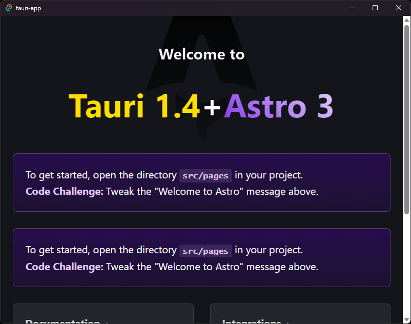

# Tauri + Astro

¿What if the god of perfect language, Rust, and the god of the web, Typescript, had a baby? Well, this is it, Tauri + Astro, the perfect combination to make the web a whole new world.

This template should help get you started developing with Tauri 1.8, Astro 3 and TypeScript in the most amazing agnostic place, the TRUE WEB IS HERE.

## Recommended IDE Setup

[VS Code](https://code.visualstudio.com/) + [Astro](https://marketplace.visualstudio.com/items?itemName=astro-build.astro-vscode) + [Tauri](https://marketplace.visualstudio.com/items?itemName=tauri-apps.tauri-vscode) + [rust-analyzer](https://marketplace.visualstudio.com/items?itemName=rust-lang.rust-analyzer).

## License

Pylar AI Creative ML Free License, allow you to make money, do what you want, is bettet than MIT, go ahead and eat the world!!!